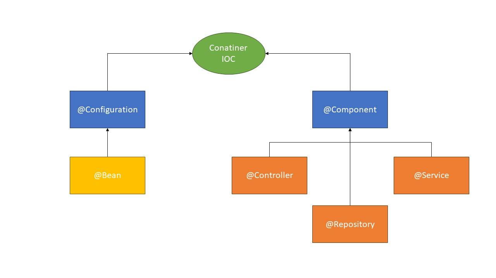

# Spring Boot Expert: JPA, RESTFul API, Security, JWT e Mais
* [Curso Spring Boot Especialista](https://github.com/cursodsousa/curso-spring-boot-especialista)

Primeiros passos instalar:
* Java JDK
* IntelliJ
* MySQL
* Postman
* [Maven](https://maven.apache.org/download.cgi)


## Spring Boot Core e Spring Framework
### Criando um projeto Spring boot do zero no IntelliJ
* Create New Project -> Project SDK: 1.8 Java -> Maven -> Next

* [pom.xml](./vendas/pom.xml): gerenciador do Maven de building para o Java e pode adicionar plugins e dependências etc
  * [Maven Repository](https://mvnrepository.com/)
  * adicionar o parent do Spring Boot, pois o parent é uma biblioteca que vai configurar automaticamente toda a aplicação Spring Boot
  * Pesquisar Spring Boot Starter Parent (quando definimos o PARENT todas as versões da dependência instalarão as versões compatíveis com o parent)
    * Copiar o xml e trocar Dependency por Parent e remove o type pom
    * Adicionar estrutura dependencies
      * definir **groupId** como org.springframework.boot e **artifactId** spring-boot-starter
    * Adicionar estrutura build, plugins e plugin
      * definir **groupId** como org.springframework.boot e **artifactId** spring-boot-maven-plugin

* Criar o arquivo VendasApplication e digitar psvm e o IntelliJ vai criar o método main e colocar a annotation **@SpringBootApplication** e esse annotation vai reconhecer que essa classe que vai inicializar uma aplicação Spring Boot
  * dentro do método main inserir o SpringApplication.run(VendasApplication.class, args);

* Para rodar basta clicar no play ao lado do método main e dar um run


### Hello World com Spring Boot
Para usar a annotation @RestController precisamos adicionar a dependência spring-boot-starter-web e irá configurar o módulo Web do Spring Boot
* Colocar a annotation em cima da classe, que significa que essa classe poderá mandar mensagens para o browser
  * Usar o GetMapping para que quando digitar "/hello", irá executar o método helloWorld()
  * http://localhost:8080/hello


### Starters: Como funciona a mágica por trás do Spring Boot
* Cada starter tem uma série de configurações que vem junto com ele
Starters:
* Data JPA, Security, Test


### Configurations e Beans
* Criar a class MinhaConfiguration
  * Annotation @Configuration é escaneado pelo Spring Boot e aplicar as configurações
  * As configurações são feitas através de Beans
    * com o método applicationName e a annotation Bean com o name de applicationName, está dizendo que é para criar esse objeto String com o valor "Sistema de Vendas" no contexto da aplicação para ser usado onde precisar
    * Poderíamos, por exemplo, fazer uma configuração de conexão com a base de dados, email, etc
  * Annotation @Autowired e @Qualifier (este serve para identificar que ele injete a String do método que possui a Bean na variável String que possui o @Qualifier)


### O Container IOC do Spring Framework
* IOC (Inversion of Control)


* Por exemplo, as classes com o annotation @Repository cria instâncias com escopo Singleton e fica disponível dentro do container e disponível para uso onde precisar

* Além dos itens na imagem acima, a outra forma de fazer o Spring Boot escanear é usando a annotation @ComponentScan(), que especifica quais os componentes de classe de configuração e o objeto que tem que escanear
  * Lembrando que caso o ComponentScan não seja utilizado, os @Service, @Repository etc serão escaneados da mesma forma, sem precisar informar no ComponentScan. Pois tudo o que está abaixo do pacote io.github.rafaelpeinado será escaneado.
  * O ComponentScan vale a pena usar quando vamos usar um pacote de terceiro e o ComponentScan poderá escanear esse pacote com.umaoutrabiblioteca.projeto


### Injeção de Dependências
* O ClientesRepository é uma dependência do ClientesService, porém no primeiro exemplo instanciamos esse objeto com new ClientesRepository();
  * Por exemplo, nesse caso de acessar o banco de dados, isso é uma tarefa complicada e pesada. Se toda vez que fizermos uma ação que conecta ao banco de dados e criar uma nova instância, podemos sobrecarregar o sistema.
  * Com a Injeção de Dependências isso seria resolvido, pois apenas uma classe ClientesRepository ficará disponível
* Para fazer a injeção criamos um construtor e colocamos a annotation @Autowired para informar que há uma injeção naquele construtor
  * No construtor podemos omitir o @Autowired, pois como a classe já está com annotation de @Service, ele já entende que o construtor está injetando uma dependência
* Também podemos injetar diretamente na variável repository, colocando o @Autowired em cima da variável e remover o construtor
* Ou pelo setRepository


### Configuração externalizada: Application Properties
* O arquivo application.properties na pasta resources já é esperado pelo Spring Boot
  * Podemos definir configurações como, por exemplo, o nome da aplicação e usar o annotation @Value e informa a chave criada no [application.properties](./vendas/src/main/resources/application.properties)

* [Common Application Properties](https://docs.spring.io/spring-boot/docs/current/reference/html/application-properties.html)
  * Configurações convencionada:
    * server.port: define a porta que quer executar a aplicação
    * server.servlet.context-path: informa o caminho para o servidor
  * agora o programa irá rodar com localhost:8081/sistema-vendas
* Podemos criar customizações do ambiente, como perfil para teste, produção e dev


### Trabalhando com múltiplos ambientes e profiles
* criar os arquivos com a convenção ainda
  * application-development.properties
  * application-production.properties
* spring.profiles.active: para definir em qual ambiente a aplicação está rodando
  * no caso dos exemplos eram **production** ou **development**

* Também podemos usar os profiles para definir quais configurações funcionarão no ambiente de produção ou ambiente de desenvolvimento.
  * No exemplo, modificamos o arquivo [MinhaConfiguration.java](./vendas/src/main/java/io/github/rafaelpeinado/MinhaConfiguration.java) com a annotation @Profile("development")
  * Criamos uma Bean com o CommandLineRunner que tem a função de quando a aplicação subir o Spring Boot vai procurar todos os @Beans que são CommandLineRunners e vai executar o código que tem dentro dele, que é um código que executa sempre que a aplicação inicializa


### Criando annotations customizadas de configuração
* Criar um arquivo do tipo annotation Development e importar as annotation @Configuration e @Profile("development"), além das annotations obrigatórias de quando estamos criando uma annotation:
  * **@Target(ElementType.TYPE):** será elegível apenas para classe, pois só classe pode ser Configuration
  * **@Retention(RetentionPolicy.RUNTIME)**

Para os exemplos da annotation de Gato e Cachorro foi usado o **@Target(ElementType.FIELD)**, pois é uma variável

Durante o exemplo deu erro, pois existem duas Beans do CommandLineRunner com o nome executar, sendo assim para diferenciar essas beans, uma das beans foi nomeada [executarAnimal]("./vendas/src/main/java/io/github/rafaelpeinado/VendasApplication.java")


## Persistência e Acesso a Dados com Spring Data JPA
### Configurando e obtendo conexões com bases de dados
* Para começar a trabalhar com conexão de base de dados a dependência que precisamos instalar é **spring-boot-starter-data-jpa** e o driver do banco de dados **com.h2database h2**

No [application.properties](./vendas/src/main/resources/application.properties):
* spring.datasource.url=jdbc:h2:mem:testdb
* spring.datasource.driverClassName=org.h2.Driver
* spring.datasource.username=sa
* spring.datasource.password=password
* spring.jpa.database-platform=org.hibernate.dialect.H2Dialect
* spring.h2.console.enabled=true
* spring.h2.console.path=/h2-console

E para rodar esse console, precisaremos instalar a dependência **spring-boot-starter-web**

Por padrão, o Spring Boot utiliza o [HikariCP](https://github.com/brettwooldridge/HikariCP) como data source, como pool de conexões padrão


### Scripts de criação do banco de dados
Como estamos usando o H2 e ele é um banco de memória, ou seja, toda vez que a aplicação for finalizada, perdemos os dados. Sendo assim, foi criado o arquivo [data.sql](./vendas/src/main/resources/data.sql) para armazenar os scripts do banco de dados


### Criando as classes de modelo
* A primeira classe será domain.entity.Cliente
* Usamos BigDecimal para representação monetária


### Salvando e recuperando clientes
* Agora vamos criar os repositories ou DAO (Data Access Object), é uma classe que encapsula todas as operações de uma entidade

* A annotation @Repository recebe o annotation @Component e também informa para o Spring Boot, que essa classe vai fazer operações na base de dados e os Exception Translator
  * Caso não queira usar o @Repository, pode-se usar o @Component

Iremos usar o JdbcTemplate que já vem com as conexões configurada e usamos o @Autowired para injetar o JdbcTemplate e este permite fazer operações na base de dados
* usamos o método **update()** para inserir, atualizar ou deletar no banco de dados 
* usamos o método **query()** para consultar o banco de dados, e o segundo parâmetro precisa ser um **RowMapper**, que mapeia o resultado o banco de dados para uma classe

* System.out::println: **::** é método de reference do Java 8


### Concluindo o cadastro de clientes
Implementado métodos deletar e atualizar.


### Mapeando a Entidade Cliente para JPA
* Para sinalizar que é uma entidade JPA, devemos usar a annotation @Entity e, se quiser, @Table
  * A @Table não é obrigatória, a menos que o nome da entidade seja diferente do nome da tabela
  * por exemplo, se a tabela se chamasse tb_cliente, seria necessário usar o @Table(name = "tb_cliente") e também podemos definir qual schema vamos usar
* **@Id:** para definir qual a primary key da entidade
* **@GeneratedValue:** para auto incremento
* **@Column:** também é opcional igual ao annotation @Table, pois se o nome da propriedade for igual ao da coluna, não é necessário usar.
  * É possível definir se o campo é único, nullable, etc


### Persistindo entidades com Entity Manager
* Não será mais necessário utilizar o arquivo data.sql para inicializar o banco, pois, por padrão, o JPA já cria os objetos no banco

* O EntityManager já faz o mapeamento dos campos
  * para salvar, usamos o método **persist(objeto)**
  * usar a annotation **@Transactional** da SpringFramework
  * se não usar a annotation, teremos o erro **TransactionRequiredException**


### Refatorando as outras operações para o JPA
* para **atualizar**, usamos o método **merge(objeto)**
* As entidades JPA tem um estado, por exemplo, antes de salvar ela é uma entidade que não foi salva ainda, ou seja, é uma entidade transiente e ele não possui ID, então quando fazemos o persist, ela passa a entrar no status Manager, ou seja, está sendo gerenciado. Então quando salvamos o cliente, ele passa a ser gerenciado pelo Entity Manager e fica lá no cache e dependendo de como vamos recuperar esse dado, ele não precisa nem consultar na base de dados.
  * Então quando fazemos **merge**, significa sincronizar a mudança do dado para com o que está no EntityManager

* para **remover**, basta usar o método **remove(objeto)**
  * por id fazemos, **find(Cliente.class, id)** para encontrar o cliente 

* **@Transactional(readOnly = true):** informa que a transação é somente de leitura. Sendo assim, essa pesquisa passa por algumas otimizações, o que deixa mais rápido.
* **buscaPorNome** vamos fazer uma **pesquisa jpql**: "select c from Cliente c where c.nome = :nome"
  * :nome define o parâmetro do JPA

* No exemplo deu um erro, Removing a detached instance que significa que estamos tentando remover um Cliente transiente
  * sendo assim, implementamos **entityManager.contains** e fazemos o merge para sincronizar os dados


### Introdução aos repositórios Spring Data
* JPA Repositories: interface para ter algumas implementações prontas
  * Já tem o EntityManager encapsulado
  * o save tanto salva quanto atualiza os dados


### Query Methods
* É um método que se transforma em um query
* Ao usar a convenção findBy Nome, ele vai fazer a busca por nome, pois nome é uma propriedade de Cliente
* A consulta é feita em tempo de compilação
* Outros padrões em HQL:
  * List<Cliente> **findByNomeOrId**(String nome, Integer id), lembrando que as propriedades precisam existir em Cliente
  * List<Cliente> **findByNomeLikeOrId**(String nome, Integer id)
  * List<Cliente> **findByNomeOrIdOrderById**(String nome, Integer id)
  * O find é usado para trazer uma coleção de dados
  * para encontrar apenas um cliente, usamos Cliente **findOneByCpf**(String cpf);
  * os parâmetros precisam estar em ordem, de acordo com o que foi colocado no query methods, por exemplo findByNomeOrId os parâmetros precisam ser (String nome, Integer id)
  * podemos retornar um boolean, para ver se o dado existe **existsByNome**(String nome)


### Logando o SQL gerado no console
* Feature do Spring Data JPA, um recurso conhecido do Hibernate ou JPA
  * Mostrar na saída do console o SQL que está sendo gerado nas consultas
* spring.jpa.properties.hibernate.show_sql=true
* spring.jpa.properties.hibernate.format_sql=true


### Trabalhando com @Query
* Como criar queries string para executar dentro do JPA
* Nesse caso podemos dar qualquer nome para o método e devemos inserir a annotation **@Query**
* Precisa inserir a annotation @Param para informar que aquele parâmetro do método está associado ao :nome do value da Query
* Também podemos usar SQL nativo ao invés do HQL
  * desta forma, mudaríamos de: @Query(value = "select c from Cliente c where c.nome like :nome", nativeQuery = true) 
  * para: @Query(value = "select * from cliente c where c.nome like %:nome%", nativeQuery = true)
* Podemos também usar a opção deleteByNome(String nome)
  * ou usar o Query, porém como não é uma consulta, precisamos informar ao Spring que é uma transação com @Modifying


### Mapeando as entidades Produto, Pedido e ItemsPedido
* Foram inseridos os annotations nos atributos
* **CLASSE PEDIDO**
  * Na Classe Pedido vamos fazer a primeira relação entre Cliente e Pedido
    * sendo assim, usamos a annotation **@ManyToOne**, pois temos muitos pedidos para um cliente, então o Many é referente a entidade atual
    * além disso, usamos o **@JoinColumn**, para apontar que é um foreign key
    * se por algum motivo eu precisar fazer o mapeamento de todos os pedidos do cliente, podemos definir um **Set**<Pedido> na classe Cliente com **@OneToMany** e o mappedBy, pois não temos uma chave para pedidos, quem tem a chave é o Pedido. Desta forma, o join é feito por mappedBy
      * ao invés de Set, poderia ser Collection, List, entre outros
      * o Set evita alguns erros do Hibernate
    * Como o total é um BigDecimal e representa um valor, podemos usar @Column(name = "total", **length** = 20, **precision** = 2)

* **CLASSE ITEMPEDIDO**
  * foi feito as relações com @ManyToOne
  * foi inserido uma List<ItemPedido> na classe Pedido, para ver o comportamento em relação o Set
    * O Set não aceita pedidos repetidos para um cliente 
  * Em Produto não foi feito a associação dos ItemPedido, pois não precisamos resgatar os ItemsPedidos


### Criando os Repositórios das entidades
* O JPARepository tem uma implementação padrão no Spring Data, SimpleJpaRepository

### Fazendo consultas com relacionamentos JPA
* Carregar os pedidos de um cliente usando fetch, que seria trazer junto
  * fetch default LAZY, significa que toda vez que obtermos o cliente da base de dados, ele não vai trazer os pedidos, apenas se fizer um fetch e pudemos mudar para o EAGER usando **@OneToMany(mappedBy = "cliente", fetch = FetchType.EAGER)**, mas não é recomendado, pois tem momentos que queremos carregar os clientes e não precisaremos dos Pedidos. E usando o EAGER, toda vez que usarmos o cliente, virão os pedidos
  * foi criado o método **findClienteFetchPedidos()** que fará um left join para trazer todos os clientes, independente se ele tiver pedidos ou não


### Carregando os pedidos por cliente
* para arrumar o problema do banco de dados basta usar **@Column(name = "total", precision = 10, scale = 2)**, pois precision define o tamanho do número e o scale a quantidade de casas
* Também podemos buscar no repositórios de Pedidos fazendo um **findByCliente()**
* Não é muito usual trazer os pedidos junto com cliente (findClienteFetchPedidos), exceto se tivermos um formulário ou tela no sistema, que queremos mostrar o cliente e a lista de pedidos do cliente.


### Artigo: Algumas considerações sobre @Transactional
* **Cenário 1:** Tenho um método no meu serviço que salva um pedido, os itens do pedido e a forma de pagamento.
  * Caso um dos passos dê erro na hora de gravar as informações no banco, será feito um rollback da transação como um todo

``` java
@Transactional
public void salvarPedido(Pedido pedido){    
    pedidoRepository.save(pedido);    
    itemPedidoRepository.save(pedido.getItens());    
    pagamentoRepository.save(pedido.getPagamento());
}
```

* **Cenário 2:** Tenho muitas entidades na aplicação e de bancos de dados distintos.
  * Por exemplo, tenho mais de dois banco de dados. O MySQL e o Oracle. Sendo assim, devemos informar para qual banco aquela informação será enviada. 
  * Além disso, é necessário necessário configurar o transactionManager de cada uma nas suas configurações.
  * 
``` java
@Transactional("transactionManagerMySQL")
public void salvarFuncionario(Funcionario fun){    
    funcionarioRepository.save(fun);
}
```


## Spring Web: Desenvolvimento de API RESTful
### Criando o controller de clientes
* Vamos informar que é um Controller e vai receber requisições HTTP e vai se comunicar dentro da arquitetura REST
  * **@Controller:** definir o annotation que vai informar que essa é a camada que vai se comunicar com os clientes 
  * **@RequestMapping("/api/clientes"):** vai ser a url base da api de clientes com "/api/clientes", ou seja, toda requisição que tiver essa url, ele vai entrar no ClienteController. **Esse RequestMapping não é obrigatório. Todo o caminho pode ser definido no RequestMapping do método**
  * **@RequestMapping(value = "/hello/{nome}", method = RequestMethod.GET):** definiu a url que será usada para entrar no método helloClientes, do tipo GET
    * **@PathVariable("nome"):** informando que vamos receber uma variável do Path
  * **@ResponseBody:** para definir que a String que está sendo retornada é o corpo de uma resposta
* http://localhost:8080/api/clientes/hello/nome-do-cliente


### Mapeando as Requisições com Request Mapping
* **@RequestMapping(value = "/hello/{nome}", method = RequestMethod.GET):** eu posso definir mais de um value, informando uma array de urls
  * podemos definir **consumes:** podemos mandar no corpo da requisição objetos do tipo JSON ou XML = {"application/json", "application/xml"} (mas como no exemplo é do tipo GET, não será enviado nada)
  * **value:** array de urls = {"/hello/{nome}", "/{nome}"}
  * **produces:** tem a mesma lógica do consumes, porém é a forma como vamos retornar os objetos e é o cliente quem definirá o tipo de retorno
  * caso for usado o método POST, igual no helloClientes2, o consumes poderá ser definido e o body será recebido pela annotation @RequestBody


### Requisição GET com parâmetros e Response Entity
* Não vamos definir o consumes e o produces, porque o Spring trabalha com JSON por padrão
* Toda a annotation **RequestMapping** pode ser trocada por uma annotation especializada, a **GetMapping**
  * Temos que manter o **ResponseBody**, porque ele retorna um objeto do tipo JSON
* O retorno do objeto é do tipo **ResponseEntity**
  * é um objeto que representa o corpo da resposta
  * podemos fazer uma série de configurações nele
    * HttpStatus
    * Body
    * Headers
* **(@PathVariable Integer id):** não precisa inserir o nome, porque os parâmetros são iguais
* **clientes.findById(id):** retorna um Optional, porque pode ou não ter um cliente


### Requisição POST e Request Body
* No Postman, vamos criar um Request do 
  * tipo POST
  * url: http://localhost:8080/api/clientes 
  * Body do tipo raw JSON, pois podemos digitar o que quisermos

* Para não vir os pedidos quando fizer um getClienteById, usamos o **@JsonIgnore**


### Delete Mapping: deletando um recurso no servidor
* **NoContent:** porque é um status de sucesso, mas não precisamos retornar nada e também não precisa receber nenhuma informação
* **NotFound:** como estamos navegando para uma url, caso o recurso não exista, devemos informar not found


### Put Mapping - Atualizando um cliente
* Put é usado para atualizar integralmente um recurso no servidor, por exemplo, se não enviarmos um dos dados, o dado será salvo como nulo
* **map:** método do Optional que caso tenha um cliente, entrará no método
* **NoContent:** pois quando estamos fazendo atualização não precisamos retornar nenhum item
* **Supplier:** é uma interface funcional que não recebe nenhum parâmetro e retorna qualquer coisa


### Pesquisa de Clientes por parâmetros
* **Example:** vai pegar as propriedades que estão populadas e vai criar um Example
* **matching().withIgnoreCase():** ignorar que independente da String estar em caixa alta ou baixa (case), que faça o matching
* **withStringMatcher():** a forma como vamos definir como é para procurar os valores String
* Todas essa configuração de matcher é enviado via queryParams


### @ResponseStatus e @RestController: Refatorando api de clientes
* Vamos remover o @Controller para **@RestController**, que é uma annotation especializada de controller, que já vem com a annotation **@ResponseBody**, o que significa que não precisamos inserir essa annotation em todos os métodos
* Vamos remover o **ResponseEntity** e retornar direto a entidade
  * Se retornarmos o objeto direto, quer dizer que o response é OK
* Quando criamos um recurso no servidor, nós retornamos 201 que é created
  * para isso, podemos usar a annotation **@ResponseStatus(HttpStatus.CREATED)**


### Desafio da API de Produtos
* Consultar
* Criar
* Remover
* Atualizar
* Pesquisar


### Implementando a API de Produtos
* importação estática e não precisaria colocar toda o HttpStatus
  * import static org.springframework.http.HttpStatus.* e depois só usar CREATE, NO_CONTENT, etc
  * return Void.TYPE para não retornar null


### Criação do Controller e Serviço de Pedidos
* Como vamos precisar de mais de um repository, vamos criar um serviço
* Ao inserir a interface no construtor, tivemos um erro que o PedidoController requer um bean do tipo PedidoService
  * Para isso, criamos o PedidoServiceImpl
  * isso é criado, porque é uma boa prática para facilitar ao fazer testes unitários ou de integração
  * vamos colocar **@Service**


### Trabalhando com modelo DTO
* Essa classe DTO (Data Transfer Object) é um padrão que serve para mapear o objeto com propriedades simples que recebemos via requisição e depois transformamos no modelo de dados para persistir
* ItemPedidoDTO
* PedidoDTO

Exemplo:
``` json
{
    "cliente": 1,
    "total": 100,
    "items": [
        {
            "produto": 1,
            "quantidade": 10
        }
    ]
}
```

### Utilizando o Projeto Lombok
* Em todas as classes estamos criando os getters e setters
* Para eliminar essa necessidade, podemos usar o [Lombok](https://projectlombok.org/)
* [Instalar o plugin do Lombok](https://projectlombok.org/download)
  * Serve para reconhecer os códigos que não vamos colocar nas classes
  * Sendo assim, usamos as annotations **@Getter** e **@Setter**. Quando colocamos essas annotations, é para inserir os getters e setters na hora de compilar, igual exemplo na pasta [target](./vendas/target/classes/io/github/rafaelpeinado/domain/entity/Pedido.class)
  * Também temos as annotation **@ToString**, **@EqualsAndHashCode**, **@NoArgsConstructor**, **@AllArgsConstructor**, **@Data**
    * **@Data:** é a compilação de algumas annotations como **Getter, Setter, RequiredArgsConstructor, ToString, EqualsAndHashCode**
    * **@[EqualsAndHashCode](https://projectlombok.org/features/EqualsAndHashCode)** 
* Mesmo usando o Lombok, ainda podemos criar o próprio getter ou setter, pois as vezes precisamos fazer um getter personalizado, por exemplo


### Método para realização de um pedido
* Em PedidoServiceImpl removemos o construtor e usamos o **@RequiredArgsConstructor** que cria um construtor com todos os argumentos obrigatórios e para definir quais são obrigatórios é só sinalizar com **final**, que tem que ser instanciado no momento da criação da classe
* Como o **clientesRepository.findById(idCliente)** retorna um optional e pode retornar um erro, pois podemos informar uma id que não existe. Nesse caso não vamos mandar um not found, porque não estamos tentando procurar um dado no servidor, e sim salvar. Então lançamos uma exception específica para esse caso de erro na regra de negócio.
  * Dessa forma, vamos criar a classe RegraNegocioException
* Temos que salvar o pedido e também os items de pedido, porque não existem pedido sem items
* Precisar finalizar **converterItems** com **collect**, porque o map do stream, retorna outra stream contendo os novos itens. Então temos que transformar a stream em uma lista de ItemsPedido

* No método salvar, nós criamos um pedido e ainda não salvamos pedido, ou seja, ele ainda não tem um id quando mandamos para converterItems. Sendo assim, no map nós não podemos salvar os itens do pedido, porque ele precisa desse id.
  * Após **repository.save(pedido)** nós já temos um id, então agora podemos fazer um **itemsPedidoRepository.saveAll(itemsPedido)** de todos os itens. 
* No método salvar nós usamos a annotation **@Transactional**, pois ele vai garantir que tudo o que está no método seja salvo, ou ele faz um rollback


### Realizando um pedido através do Postman
* POST com http://localhost:8080/api/pedidos, sem cliente cadastrado causou erro 500, o que significa que temos que tratar esse erro

``` json
{
    "cliente": 1,
    "total": 100,
    "items": [
        {
            "produto": 1,
            "quantidade": 10
        }
    ]
}
```


### Spring Boot Dev tools
``` xml
<dependency>
  <groupId>org.springframework.boot</groupId>
  <artifactId>spring-boot-devtools</artifactId>
</dependency>
```

* Usando essa dependência não há necessidade de reiniciar a aplicação toda vez que fizer um ajuste
* Após fazer terminar de fazer as alterações, basta usar Ctrl + F9


### Utilizando o Controller Advice e os Exception Handlers para tratar erros na API
* **@ControllerAdvice:** conseguimos fazer tratamentos usando exception handlers
* **Arrays** tem um método estático, **asList** que recebe um objeto e transforma em uma **ArrayList**
* **@ExceptionHandler:** marca para ser um tratador de erro. Toda vez que o projeto lançar um RegraNegocioException, ele vai cair dentro do ExceptionHandler handleRegraNegocioException.
  * Usar o **@ResponseBody** ou **@RestControllerAdvice** que já possui um ResponseBody
  * @ResponseStatus(HttpStatus.BAD_REQUEST)


### Obtendo os detalhes de um pedido
* Estamos usando **InformacoesPedidoDTO**, pois a entidade Pedido tem dados do cliente, e nesse caso não queremos expor os dados do cliente publicamente
* **@Builder:** ele vai gerar com todas as propriedades uma classe builder e vai disponibilizar essa instância para construir um objeto de InformacoesPedidoDTO
* Em [PedidoController](./vendas/src/main/java/io/github/rafaelpeinado/rest/controller/PedidoController.java) no método **InformacoesPedidoDTO** usamos o InformacoesPedidoDTO.builder() na qual eu consigo ir settando os valores sem precisar instanciar o objeto
* **Collections.emptyList():** não é boa prática retornar objetos nulos, é melhor retornar uma lista vazia
* Obtivemos um erro, pois não aceitou a sintaxe do Query Methods, então precisamos criar uma @Query no **findByIdFetchItems**
  * **@Param("id"):** definir o parâmetro


### Criando o status do Pedido
* **@Enumerated:** Enum não existe no banco de dados, mas usamos isso para gravar como String
  * **EnumType.STRING:** grava a String
  * **EnumType.ORDINAL:** grava a posição
* .status(pedido.getStatus()**.name()**): o name() pega um Enum e transforma em uma String


### Patch Mapping - realizando cancelamento de pedidos
* @**PatchMapping:** só queremos atualizar um campo e todos os outros campos devem ser ignorados. Então, ao invés de PUT usamos o PATCH.
* Não é boa prática usar a camada de serviços para lançar exceções de API
* Também não é legal fazer um RegraNegocioException, porque não é uma regra de negócio
* **StatusPedido.valueOf(dto.getNovoStatus()):** para encontrar o valor da Enum a partir de um String


## Bean Validation
### Starter Validation

``` xml
<dependency>
    <groupId>org.springframework.boot</groupId>
    <artifactId>spring-boot-starter-validation</artifactId>
</dependency>
```


### Utilizando e Testando o Bean Validation
* **@NotEmpty(message = ""):** o nome não pode ser nulo ou vazio, e se for retornará uma mensagem
* **@Valid:** colocar no método da request que a validação aconteça
* Quando o nome do cliente não é passado, foi retornado um Bad Request e informando uma lista de erros
* Criamos um Exception do tipo MethodArgumentNotValidException, para que o retorno do erro seja padronizado
  * **.map(erro -> erro.getDefaultMessage()):** vai retornar a mensagem que informamos no @NotEmpty


### Validando a entidade cliente
* **@CPF:** validador de CPF


### Validando a Entidade Produto
* **@NotEmpty:** é usado em Strings, porque não queremos nem nulo e nem vazio
* **@NotNull:** no caso de preço, ou é zero ou é nulo


### Validando a entidade Pedido
* Vamos validar o RequestBody que estamos recebendo, então vamos validar o **PedidoDTO**
* Vamos criar um validador customizado para Lista dos itens do pedido


### Criando uma annotation de validação customizada
* **@Retention(RetentionPolicy.RUNTIME):** para ser verificada em tempo de execução
* **@Target:** onde podemos colocar a annotation
* **@Constraint(validatedBy = NotEmptyListValidator.class):** aqui é onde vamos dizer que a annotation é uma annotation de validação e temos que inserir classe de validação
  * A classe criada é a **NotEmptyListValidator**, que implementa **ConstraintValidator** e recebe dois parêmetros, o NotEmptyList que é a annotation criada e o tipo de dado que vai ser validado, no caso, List
  * Além disso, é obrigatório ter os três métodos
    * message(), groups(), payload()
    * Toda validation de validação tem esses métodos
* No NotEmptyListValidator podemos pegar algumas informações como:
  * o método **initialize** nos permite pegar algum dado da annotation
  * podemos inserir mais propriedades no **NotEmptyList**


### Internacionalização
* Foi criado o arquivo message.properties e informado nas áreas de mensagem {nome.do.campo}
* Depois foi criado a classe **InternacionalizacaoConfig**
  * criar um ReloadableResourceBundleMessageSource e definir qual é o arquivo base com setBasename
  * não é necessário colocar .properties, pois o ReloadableResourceBundleMessageSource já subentende que é um arquivo properties
* **LocalValidatorFactoryBean** vai pegar o message source e é responsável pela interpolação


## Spring Security e JWT
### Adicionando o módulo Security
* Instalar:

``` xml
<dependency>
  <groupId>org.springframework.boot</groupId>
  <artifactId>spring-boot-starter-security</artifactId>
</dependency>
```

* Agora, quando reiniciar a aplicação, será exibido uma senha **Using generated security password** e para fazer uma requisição vai ser necessário usar essa senha e user: user
* **http://localhost:8080/login:** será direcionado para tela de login automaticamente


### Criando a classe de configuração do Security
* Criamos o arquivo SecurityConfig e colocamos a annotation **@EnableWebSecurity**
  * Não precisamos colocar @Configuration
  * Ao extender **WebSecurityConfigurerAdapter**, temos acesso a dois métodos **configure**:
    * **AuthenticationManagerBuilder**: vai trazer os objetos que fazem autenticação dos usuários e adicionar os usuários dentro do contexto do Security
    * **HttpSecurity**: pega o usuário que está autenticado e verifica se tem autorização para a página


### Password encoder
* **passwordEncoder:** vai criptografar e descriptografar as senhas dos usuários
* **BCryptPasswordEncoder:** é um algoritmo avançado de autenticação e toda vez que o usuário passa uma senha, ele gera um hash. Toda vez que gera um hash da mesma senha, ele gera um hash diferente


### Configurando autenticação em memória
* **auth.inMemoryAuthentication():** para criar configuração em memória
  * Agora, ao iniciar, ele não gera uma senha temporária

``` java
auth.inMemoryAuthentication()
                .passwordEncoder(passwordEncoder())
                .withUser("fulano")
                .password(passwordEncoder().encode("123"))
                .roles("USER");
```


### Configurando a autorização de urls
* **csrf:** permite ter uma segurança entre a aplicação web e backend, mas como estamos usando o modelo REST, é stateless e não precisa do csrf
* **antMatchers():**
  * **authenticated:** precisa estar autenticado para acessar a URL e/ou método informados
  * **hasRole:** se tem a role que foi definida, por exemplo, "USER"
  * **hasAuthority:** se tem a autorização, por exemplo, "MANTER_USUARIO"
  * **permitAll:** ela é permitida por todos
* **and:** volta para raiz e acrescenta mais uma configuração HttpSecurity
* **formLogin:** cria tela de login


### Configurando as Roles e Authorities
* **hasAnyRole:** recebe array de roles
* o user recebeu role de USER e ADMIN


### Autenticação Basic
* **httpBasic:** vamos mandar informações através do header
* No Postman, Authorization -> Type -> Basic Auth


### Implementação do UserDetailsService
* Foi criado o **UsuarioServiceImpl** que implementa a interface **UserDetailsService** do SpringFramework
  * Essa interface serve para definir o carregamento do usuários a partir da base de dados
* Colocar a annotation **@Service**
* em seguida:

``` java
@Autowired
    private UsuarioServiceImpl usuarioService;
```

* Trocamos o usuário em memória por userDetailsService:

``` java
protected void configure(AuthenticationManagerBuilder auth) throws Exception {
        auth
                .userDetailsService(usuarioService)
                .passwordEncoder(passwordEncoder());
    }
```

* No **UsuarioServiceImpl**, vamos fazer a injeção do PasswordEncoder e fazer o build de um objeto User


### Implementando o cadastro de usuários
* Criou uma entidade usuário
* Ao salvar o usuário, a senha está sendo mostrada. Sendo assim, vamos criar um DTO para não retornar a senha no request


### Testando a autenticação com cadastro de usuários
* Mesmo que seja para permitir tudo, é muito importante cadastrar as urls no SecurityConfig
* **.anyRequest().authenticated():** importante, pois se criarmos novas URLs, nós precisamos que pelo menos a autenticação esteja garantida em todas as URLs


### Introdução ao JWT
* [JSON Web Token](https://jwt.io/)
* O JWT tem três partes
  * **Header**
  * **Payload:** conteúdo customizado do token
  * **Verify Signature**

* Até o momento estamos usando Basic Auth, e isso é um problema, pois estamos enviando usuário e senha, os quais podem ser interceptados
* A biblioteca que vamos usar é a do maven io.jsonwebtoken / [jjwt](https://jwt.io/libraries)


### Gerando o Token
* Adicionar a dependência do JWT
* [Base64](https://www.base64encode.org/pt/)
* Criamos o service **JwtService**

foi usado para testar rodando em formato standalone

``` java
public static void main(String[] args) {
  ConfigurableApplicationContext contexto = SpringApplication.run(VendasApplication.class);
  JwtService service = contexto.getBean(JwtService.class);
  Usuario usuario = Usuario.builder().login("fulano").build();
  String token = service.gerarToken(usuario);
  System.out.println(token);
}
```


### Decodificando o token
* **setClaims:** para passar informações de payload e são customizáveis
* **ExpiredJwtException:** se o token estiver expirado, ele vai lançar um erro


### Implementando o Filtro do JWT
* **AuthenticationManagerBuilder:** estávamos usando para autenticar o usuário e colocar dentro do contexto do Security e não vamos mais precisar dele, pois vamos implementar outra classe
  * a classe é **JwtAuthFilter**
* **UsernamePasswordAuthenticationToken:** vamos colocar dentro do contexto do Spring Security
* **user.setDetails(new WebAuthenticationDetailsSource().buildDetails(request)):** informa que é uma autenticação web

* **doFilterInternal:** está interceptando uma requisições e obtendo as informações e antes de mandar a requisição para frente, nós inserimos uma autenticação caso o token esteja válido


### Finalizando a configuração JWT no spring security
* Vamos remover o httpBasic e vamos usar sessionManagement, pois não vamos mais criar sessões, pois durante as requisições vamos enviar tudo o que é necessário para funcionar
* Agora temos que enviar o token em todas as chamadas
* **addFilterBefore:** adicionamos um filtro que será executando antes de outro Filtro que é o UsernamePasswordAuthenticationFilter


### Implementando o método de autenticação de usuários
* Criado implantação a partir do TokenDTO


### Testando o token JWT no Postman
* Precisa inserir o header: Authorization: Bearer token-do-auth


## Migração para o Banco MySQL
### Conectando com o MySQL
* Foi criado o schema
``` sql
CREATE DATABASE vendas;

USE vendas;

CREATE TABLE cliente (
    id INTEGER PRIMARY KEY AUTO_INCREMENT,
    nome VARCHAR(100),
    cpf VARCHAR(11)
);

CREATE TABLE produto (
    id INTEGER PRIMARY KEY AUTO_INCREMENT,
    descricao VARCHAR(100),
    preco_unitario NUMERIC(20,2)
);

CREATE TABLE pedido (
    id INTEGER PRIMARY KEY AUTO_INCREMENT,
    cliente_id INTEGER REFERENCES cliente (id),
    data_pedido TIMESTAMP,
    status VARCHAR(20),
    total NUMERIC(20,2)
);

CREATE TABLE item_pedido (
    id INTEGER PRIMARY KEY AUTO_INCREMENT,
    pedido_id INTEGER REFERENCES pedido (id),
    produto_id INTEGER REFERENCES produto (id),
    quantidade INTEGER
);
```


### Fazendo a migração para o banco MySQL
* A configuração inicial ficou:

```
spring.datasource.url=jdbc:mysql://localhost:3306/vendas
spring.datasource.driverClassName=com.mysql.jdbc.Driver
spring.datasource.username=root
spring.datasource.password=root

spring.jpa.database-platform=org.hibernate.dialect.MySQLDialect

spring.jpa.properties.hibernate.show_sql=true
spring.jpa.properties.hibernate.format_sql=true

security.jwt.expiracao=30
security.jwt.chave-assinatura=YSBsZWJyZSDDqSBicmFuY2E
```

* Após rodar a aplicação, foi necessário mudar o driver

```
spring.datasource.driverClassName=com.mysql.cj.jdbc.Driver
```

* Precisou informar o time zone

```
spring.datasource.url=jdbc:mysql://localhost:3306/vendas?userTimeZone=true&serverTimezone=UTC
```

* Ao fazer um POST do usuários, tivemos um erro de "vendas.hibernate_sequence"
  * isso tem a ver com o strategy GenerationType para IDENTITY, porque fica a cargo do banco de gerar esses dados

* Agora temos outro erro, "vendas.usuario" doesn't exist
``` sql
CREATE TABLE usuario (
    id INTEGER PRIMARY KEY AUTO_INCREMENT,
    login VARCHAR(50) NOT NULL,
    senha VARCHAR(255) NOT NULL,
    admin BOOL DEFAULT FALSE
)
```

* Verificamos se a inserção e conexão está funcionando
``` sql
SELECT * FROM usuario;
```


## Documentação de API com SWAGGER
### Configurando o Swagger
* Colocamos as dependências do Swagger

``` xml
<dependency>
            <groupId>io.springfox</groupId>
            <artifactId>springfox-swagger2</artifactId>
            <version>2.6.1</version>
        </dependency>

        <dependency>
            <groupId>io.springfox</groupId>
            <artifactId>springfox-swagger-ui</artifactId>
            <version>2.6.1</version>
        </dependency>
```

* **Contact:** Dados de contato do desenvolvedor
* [SwaggerConfig](./vendas/src/main/java/io/github/rafaelpeinado/config/SwaggerConfig.java)

* Aconteceu um erro de stackoverflow, sendo assim mudamos para a versão 2.9.2

* http://localhost:8080/swagger-ui.html


### Configurando o Security no Swagger
* Criar um ApiKey
* Criar defaultAuth
* Depois disso, foi criado um botão Authorize na UI do Swagger
  * Colocar Bearer token


### Customizando a UI da Documentação da API
* **@Api("API Clientes"):** annotation para definir o nome da api
* Nos métodos:

``` java
@ApiOperation("Obter detalhes de um cliente")
@ApiResponses({
  @ApiResponse(code = 200, message = "Cliente encontrado"),
  @ApiResponse(code = 404, message = "Cliente não encontrado")
})
```


## Build e Deploy
### Gerando o JAR
* Temos no pom.xml a tag build e por padrão exporta um arquivo JAR
``` xml
<build>
    <plugins>
        <plugin>
            <groupId>org.springframework.boot</groupId>
            <artifactId>spring-boot-maven-plugin</artifactId>
        </plugin>
    </plugins>
</build>
```

* Precisamos abrir a linha de comando na raiz do projeto e digitar

``` shell | bash
mvn clean package
```

* E para rodar a aplicação usamos

``` shell | bash
cd target/
java -jar ./vendas-1.0-SNAPSHOT.jar
```


### Gerando um Arquivo WAR
``` xml
<packaging>war</packaging>
```


* Tomcat é o servidor que roda o WAR, é um servidor embarcado que vai com a aplicação no JAR

``` xml
<dependency>
    <groupId>org.springframework.boot</groupId>
    <artifactId>spring-boot-starter-tomcat</artifactId>
    <scope>provided</scope>
</dependency>
```

* o scope provided, significa que isso será provido externamente
* Precisamos estender **extends SpringBootServletInitializer** no local do main

``` shell | bash
mvn clean package
```

* O WAR podemos usar para fazer deploy em servidores Java


### Profiles Maven para builds diferentes
* Vamos preparar para rodar em dev e em prod, por exemplo
* Precisamos inserir as profiles 

``` xml
    <profiles>
        <profile>
            <activation>
                <activeByDefault>true</activeByDefault>
            </activation>
            <id>desenvolvimento</id>
            <properties>
                <project.packaging>jar</project.packaging>
                <tomcat.scope>compile</tomcat.scope>
            </properties>

        </profile>
        <profile>
            <id>producao</id>
            <properties>
                <project.packaging>war</project.packaging>
                <tomcat.scope>provided</tomcat.scope>
            </properties>
        </profile>
    </profiles>
```

* Inserir essas variáveis nas propriedades

``` xml
<packaging>${project.packaging}</packaging>
<scope>${tomcat.scope}</scope>
```

* E rodar informando o profile desejado:

``` bash | shell
mvn clean package -P desenvolvimento
mvn clean package -P producao
```


## Aulas Complementares
### Instalando o Spring Assistant no Intellij
* [spring initializr](https://start.spring.io/)
* O plugin [Spring Assistant](https://plugins.jetbrains.com/plugin/17911-spring-assistant/versions/stable) faz esse mesmo processo na própria IDE


## Aprofundando em Spring Data JPA
### Criação do Projeto Localização
* Caso a aba Maven não apareça ir em View -> Tool Windows -> Maven


### Mapeando a entidade Cidade
* Caso não seja definido o @Entity, será retornado um erro informando que a classe não é uma entidade e se não colocar o @Id, terá erro de compilação no Java


### Testando o repositório de Cidades
* A partir do Java 11 podemos usar a palavra reservada var
* Quando é Long, precisa informa a letra L no final do número 12396372L


### Automatizando scripts e logando o SQL no console
* Temos que criar um arquivo com o nome **data.sql**
* **spring.jpa.hibernate.ddl-auto=none:** não é para executar nenhum script automático
* **spring.jpa.hibernate.ddl-auto=create:** vai criar as tabelas
* **spring.jpa.hibernate.ddl-auto=drop-and-create:** dropa as tabelas antes de criar
* **spring.jpa.hibernate.ddl-auto=update:** só adiciona novos campos etc


### Utilizando Yaml no lugar de Properties nas configurações
* O Spring Boot trabalha com os dois formatos, então não precisa mudar nada para apontar para o arquivo quando renomear


### Query Methods com variantes de Strings
* findByNomeStartingWith
* findByNomeEndingWith
* findByNomeContaining


### Variantes do Like
* **findByNomeLike("%a%"):** precisa colocar %
  * **%a%:** Containing
  * **a%:** StartingWith
  * **%a:** EndingWith
* Se colocar "porto" não vamos achar nada, mas podemos tratar isso
  * Vamos usar @Query para resolver
  * **?1:** significa o primeiro parâmetro informado no método


### Queries com valores numéricos
* findByHabitantes**LessThan**
* findByHabitantes**GreaterThan**
* findByHabitantes**LessThanEqual**
* findByHabitantes**LessThanAndNomeLike**


### Paginação e Ordenação de resultados
* Coloca o parâmetro Sort e no método do service colocar Sort.by("habitantes", "nome")
  * Funciona também em queries customizadas
* **"%%%%"**: faz um findAll


### Queries by Example
* o JPARepository herda da QueryByExampleExecutor
* O Example serve para executar queries dinâmicas
* **filtroDinamico:** no primeiro momento usamos findByHabitantesLessThanAndNomeLike e mandamos habitantes null e nome "Porto Alegre", deveríamos ter um retorno da mesma forma, mas não retorna
  * Se fizermos testes com o if, teríamos que fazer vários cenários de teste para fazer a chamada de cada repository, por exemplo

``` java
if(cidade.getHabitantes() == null || cidade.getNome() != null) {
  return repository.findByNome(cidade.getNome());
}
if(cidade.getHabitantes() != null || cidade.getNome() == null) {
  return repository.findByHabitantes(cidade.getHabitantes());
}
```

* Sendo assim, podemos usar o Example para fazer isso de forma dinâmica

``` java
public List<Cidade> filtroDinamico(Cidade cidade) {
  Example<Cidade> example = Example.of(cidade);

  return repository.findAll(example);
}
```

* Após esse ajuste, ao enviar somente o nome, teremos um retorno
* Para melhorar os resultados podemos usar outros métodos:

``` java
public List<Cidade> filtroDinamico(Cidade cidade) {
  ExampleMatcher matcher = ExampleMatcher
    .matching()
    .withIgnoreCase("nome") // somente para a propriedade nome
    .withStringMatcher(ExampleMatcher.StringMatcher.STARTING);
  Example<Cidade> example = Example.of(cidade, matcher);

  return repository.findAll(example);
}
```


### Trabalhando com Specifications
* Precisamos fazer um extends de JpaSpecificationExecutor
* **O que é Specification?** É um pedaço de query, ou seja, montamos as specifications e juntamos para montar uma query
  * o método que retornamos é um toPredicate(Root, CriteriaQuery, CriteriaBuilder)
    * **Root:** nesse caso é a cidade
    * **CriteriaQuery:** é a query que está sendo construída através da Specification
    * **CriteriaBuilder:** é o objeto que constrói um criteria

* A pesquisa abaixo se parece com o findByNome

``` java
public void listarCidadesByNomeSpec() {
  Specification<Cidade> spec = CidadeSpecs.nomeEqual("São Paulo");
  repository.findAll(spec).forEach(System.out::println);
}
```

* A opção de Specification genérica não é muito aconselhável, pois fizemos Specification para queries específicas


### Montando queries dinâmicas com Specifications
* listarCidadesSpecsFiltroDinamico
* **conjunction** é a comparação 1 = 1 para depois fazer os appends com and
* [JPA Criteria API Queries](https://www.objectdb.com/java/jpa/query/criteria)


### Criando Queries com SQL nativo e Projections
* **@Query(nativeQuery = true)**
* **@Query(nativeQuery = true, value = "select * from tb_cidade as c where c.nome = :nome")**
* **@Query(nativeQuery = true, value = "select c.nome from tb_cidade as c where c.nome = :nome"):** traz só o nome da cidade

* Usamos **Projections** quando queremos trazer apenas os campos id e nome, por exemplo, mas a entidade Cidade tem qtd_habitantes, ou até mesmo fazer join com outras tabelas
  * c.id_cidade as id para que o getId do Projection possa funcionar


## Trabalhando com Docker
### Criando uma Imagem e rodando em Container
* Vamos criar um arquivo JAR (o comando abaixo é o mesmo que mvn clean package)

``` bash | shell
./mvnw clean package
```

* Criar Dockerfile na pasta raiz
* Instalar [plugin Docker](https://plugins.jetbrains.com/plugin/7724-docker)

``` bash
docker build -t rafaelpeinado/springdocker .
```

``` bash
docker images
```

``` bash
docker run --name springdockercontainer -p 8081:8080 rafaelpeinado/springdocker
```


### Montando a imagem em estágios e publicando no Dockerhub

``` bash
docker login
```

``` bash
docker push rafaelpeinado/springdocker
```

* [Play with Docker](https://labs.play-with-docker.com/): para rodar imagens pela web


## Criando um controle de acesso completo com Spring Security e Spring Boot 3
### Iniciando e configurando um Projeto Spring Boot 3
* [spring initializr](https://start.spring.io/)
* Ver se a JDK está com a versão que deveria em **File -> Project Structure**


### Criando as rotas e adicionando o Security no projeto
* Criamos rotas privada e pública
* Após inserir o starter security, tomamos unathorized por não usar a senha gerada
  * por padrão ele protege todas as rotas e o usuário padrão é user


### Tipos de autenticação mais comuns (Basic, Form e Bearer Token)
* **Http Basic** (quando temos a tela JavaScript para inserir login e senha)
  * Header Authorization: Basic (usuario+senha em base 64)
  * [Basic Auth Header Generator](https://www.debugbear.com/basic-auth-header-generator)
* **Form Login**
  * passa usuário e senha e salva o login em um Cookie
* **Bearer Token**
  * Header Authorization: Bearer (token JWT ou token opaco)
    * **Token Opaco:** é só um hash, uma chave para mandar no header
    * **Token JWT:** consegue decodificar e pegar um JSON
  * [JWT](https://jwt.io/)
  * Comum no fluxo OAuth2


### Configuração básica do Spring Security
* As annotations **@Configuration** e **@EnableWebSecurity** habilitam a classe a fazer configuração do Spring Security
* Na versão do Java 17, não precisamos mais fazer extends da classe **WebSecurityConfigurerAdapter**
* Só podemos chamar o **customizer.anyRequest().authenticated()** por último
* Quando criamos o **SecurityFilterChain**, não conseguimos mais acessar as URLs, pois não configuramos uma forma de autenticação
  * para isso, inserimos **.httpBasic(Customizer.withDefaults())**
    * é o mesmo que .httpBasic(customizer -> {})
  * e para criar o form de login, usamos **.formLogin(Customizer.withDefaults())**


``` java
@Bean
public SecurityFilterChain securityFilterChain(HttpSecurity http) throws Exception {
    return http
            .authorizeHttpRequests(customizer -> {
                customizer.requestMatchers("/public").permitAll();
                customizer.anyRequest().authenticated();
            })
            .httpBasic(Customizer.withDefaults())
            .formLogin(Customizer.withDefaults())
            .build();
}
```


### Configurando credenciais de acesso
* Configuranção semelhantes ao feito em vendas
* Ainda estamos usando httpBasic


### Como funciona o processo de autenticação no security filter chain
* Client -> **Request** -> Security Filter Chain -> **Autentication** -> API -> **Response** -> Client


### Entendendo o Authentication
* Vamos injetar o Authentication no método que queremos usar a autenticação


### Utilizando um Authentication Provider
* Para customizar precisamos estender a classe **AuthenticationProvider**
  * Caso o authenticate retorne null ou **AuthenticationException**, o Authentication não será provido para o contexto


### Autenticação via Filtro
* Se não fizer o FilterChain seguir com **filterChain.doFilter(request, response)**, a consequência será de não receber quem foi autenticado e além de tudo, todas as requisições terão acesso


### Configurando autorização baseada em Roles e Authorities
* Role: grupo de usuário (perfil de usuário) -> Master, Gerente, Frente de Loja, Vendedor
* Authotiry: permissões -> cadastrar usuário, acessar tela de relatório

* Role é uma combinação de authorities

* Por padrão, o Spring Boot exige que coloque um prefixo "ROLE_"
  * nós podemos mudar esse prefixo no Security com GrantedAuthorityDefaults


### Definindo as permissões de acesso via controllers
* Podemos usar essa configuração para não ficar definindo tudo no SecurityConfig, pois com muitas urls, pode ficar confuso
* **@EnableMethodSecurity(securedEnabled = true):** annotation para poder configurar nos controllers
* **@PreAuthorize("hasRole('ADMIN')"):** annotation nos controllers para definir a role


### Criando o domínio para o desenvolvimento de um controle de acesso
* Apenas criando entidades para controle de acesso


## Observações
### Atalhos IntelliJ
* Ctrl + Alt + O: Organiza todos os importes, inclusive apaga os que não estão sendo usados
* Ctrl + Alt + L: Indenta o código
* Alt + Insert: Getter and Setter, toString, etc
* Ctrl + F9: Build da aplicação
* Alt + Enter: sugestões para correção de erros
* Ctrl + P: mostra os parâmetros que o método pede
* Alt + Shift + Seta para cima: Mover linha de código para cima
* Ctrl + Shift + N: para procurar arquivo

