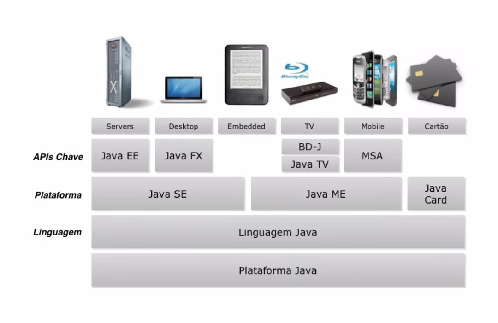

# Java Básico
## Introdução e Dicas para quem está começando
### O que é Java?
- Linguagem de Programação
- API
- Ambiente de Execução

#### Linguagem de Programação
- Simples
- Orientada a Objetos
- Distribuída
- Multithreaded
- Dinâmica
- Arquitetura neutra
- Portável
- Ótima Performance
- Robusta
- Segura

- Instalar JVM
- MyProgram.java -> **Compiler** -> MyProgram.class -> **Java VM** -> My Program

- Java é WORA - Write Once Run Anywhere

#### Plataforma e Ambiente Java
- The Java Virtual Machine
- The Java Application Programming Interface (API)

- James Gosling: criador da Java
- Sun MicroSystems -> Foi comprada pela Oracle

#### O que posso fazer com Java?
- Java SE:
  - Servers: Java EE
  - Desktop: Java FX

- Vinicius Senger: Java Embedded

- [AP Info](https://www.apinfo.com/apinfo/)

- [Como Começar a Aprender Java](https://loiane.com/2011/01/como-comecar-a-aprender-java/)

- Participar de algum JUG - Java Users Group
  - Sou Java, por exemplo
- Eventos:
  - JavaOne Brasil
  - Just Java
  - É Dia de Java
  - Javaneiros
  - Uai Jug Tech Days
  - Profissão Java
  - Conexão Java
  - JavaCE Community Conference
  - TDC
  - QCon SP
- Revistas
  - DevMedia
    - Easy Java Magazine
    - Java Magazine
  - MundoJ
  - Java Magazine (Oracle)
- Livros:
  - Head First Java
  - Learning Java - O'Reilly
  - Java Como Programar
  - OCJP - Kathy Sierra
- Cursos:
  - Global Code
  - Caelo
- Fóruns:
  - GUJ
  - Java Ranch
  - Java Free
- Certificações:
  - Java Associate
  - Java Programmer
  - Expert
    - Mobile Application Developer
    - Web Services Developer
    - JSP & Servlet Developer
    - Enterprise JavaBeans Developer
    - Java Persistence Developer
  - Master
    - Enterprise Architect
    - Java Developer

- [The Java Tutorials](https://docs.oracle.com/javase/tutorial/)
- Apostilas Caelum
- Apostilas kl9

## Instalando o Java no Windows
- **JDK (Java Development Kit):** é necessário para desenvolver. Já está incluso o JRE
- **JRE (Java Runtime Environment):** programa para executar um programa Java no computador
  - O Programa de Imposto de Renda usa o JRE

## Começando com Java
### Entendendo os Erros
#### Tipos de Erros
- Erros de Sintaxe
- Erros de Semântica
- Erros em Tempo de Execução

### Introdução a Classes e Objetos
* Paradigmas Estruturas x Orientado a Objetos

#### Vantages OO
- Reuso de código
- Reflete o mundo real
- Facilita manutenção no código

#### Conceitos
- **Classes:** descrição de um grupo de objetos
  - Nome da classe
  - Conjunto de atributos (descrição)
  - Conjunto de métodos (comportamento)
- **Objetos**
- **Herança**
  - Permite reutilização da estrutura e do comportamento de uma classe
- **Polimorfismo** (é mais voltado para comportamentos)
  - Habilidade de variáveis terem "mais de um tipo"

##### Emitir som
- Cachorro: late
- Gato: mia
- Vaca: berra
- Cobra: sibila
- Lobo: ruiva

#### Java: pacotes
- Forma de organizar as classes
- Convenção: domínio + ´projeto + pasta
- Ex: com.loiane.cursojava.aula09

