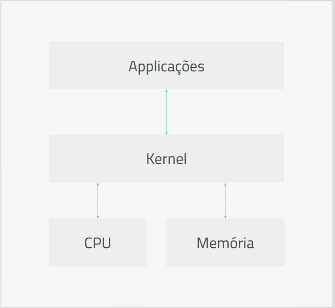
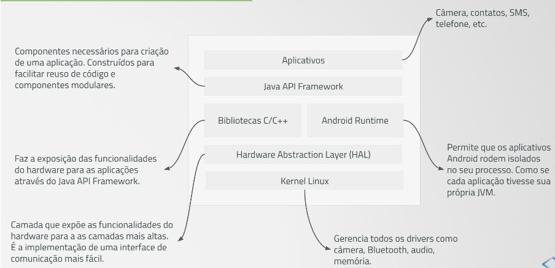
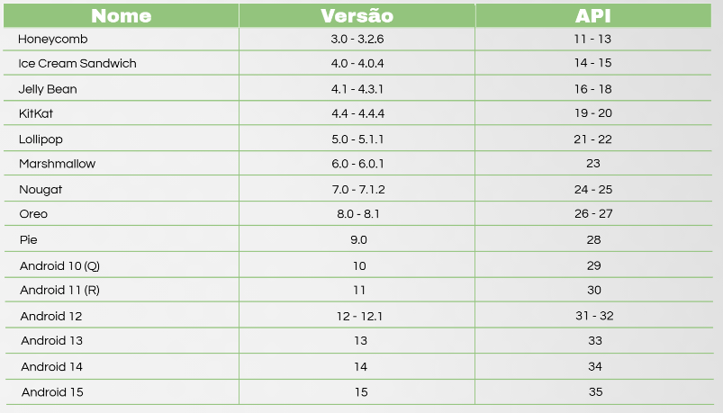

# Desenvolvimento de Aplicativos Android usando Kotlin
## Kotlin - História e conceitos
### Características
- 100% compatível com Java
  - Interoperável
  - Orientada a objetos e funcional
  - Estaticamente tipada
  - Concisa
  - Segura

- Kotlin tem null safe


## Kotlin - Conceitos Iniciais
### Variáveis mutáveis e imutáveis
- **var (variable):** para variáveis mutáveis
- **val (value):** para variáveis imutáveis


### Formatação de strings
- Interpolação: 
  - println("$hello $world!")
  - println("Double max value é: ${Double.MAX_VALUE}.")


## Kotlin - Funções
### Introdução
- Tipo Unit = void no Java


### Funções em uma única linha
- fun helloWorld(nome: String) = println("Olá, $nome")
- fun media(n1: Int, n2: Int): Int = (n1 + n2) / 2


### Formatação de Strings - Placeholder
- **%s:** String
- **%d:** Int
- **%f:** Ponto Flutuante
- **%c:** Char
- **%b:** Boolean

- **%02d:** se receber 5, ele vai imprimir 05
- **%.2f:** se receber 10,555 vai imprimir 10,55
- **Locale:** println("Valor: %02d - Salário: %.2f".format(Locale.US, 5, 16855.95000))4


### Obtendo informações do usuário
- val valor = readLine()


## Kotlin - Controle de fluxo
### Operadores para controle de fluxo
- Alternativa para avaliar intervalo de valores: n in 1..50


### Kotlin - Exceções e Null Safety
- var str: String? = null


### Operador Elvis
- println(str ?: "Nulo")
- Kotlin não tem operador ternário


### let
``` kotlin 
str1?.let {
    it.length
    it.lowercase()
    it.contains("abc")
}
```


## Kotlin - Testes unitários
### Criação da classe de testes - Parte 1
- **Assumptions.assumeTrue(countXO("xxoo")):** só seguirá os testes se essa condição for verdadeira


## Kotlin - Mais sobre funções e parâmetros
- Nothing
- Any
- vararg


## Kotlin - Orientação a objetos
### Init
- Sempre é executado assim que uma classe é instanciada


### Getter, Setter e field
- getters e setters são códigos **borderplait**, pois eles sempre são necessários
- no Kotlin o get e o set são feitos por padrão e podemos customizar usando get(), set(value)


### With

``` kotlin 
with(p) {
  acordar()
  dormir()
  doc
}
```

é o mesmo que

``` kotlin 
p.acordar()
p.dormir()
p.doc
```

- também é possível colocar a instância dentro do with. Assim, após esse trecho ser executado essa instância é deletada e libera memória

``` kotlin 
with(Pessoa("nome", 1997)) {
  acordar()
  dormir()
  doc
}
```


### Inicialização tardia - lateinit
- Serve para inicializar essa variável em outro momento
- Só vai alocar em memória quando for inicializada

``` kotlin 
lateinit var db: Database
```

``` kotlin 
if (::db.isInitialized)
```


### object e companion object
- **companion object:** define que as variáveis são escopo da classe e não do objeto
- **object:** precisa ter um nome e pode ter vários objects


## Kotlin - Orientação a objetos - Herança
### Heança
- precisa inserir a palavra **open** antes da palavra class para ser possível herdar a classe
  - **open class**


### Nested e Inner Class
- **Nested Class:** interna a outra classe
  - a classe externa tem acesso a Nested Class, porém a classe interna não tem acesso à classe externa
- **Inner Class:** essa tem acesso à classe externa


### Sealed
- Sealed é fechado para herança fora do pacote
  - **sealed class**


### Data vs Data Class
- Data Class é criada para transitar informações


### Classe Anônima
- Costuma ser usado em callback

``` kotlin
fun main() {
    imprimeValorBonus(object : Funcionario {
        override fun calculaBonus(): Float {
            return 0F
        }
    })
}
```

- object é a classe anônima


### Lambda
- **SAM:** Single Abstract Method
- Interface funcional

- A interface Funcionario precisa começar com **fun**

``` kotlin
fun interface Funcionario {
    fun calculaBonus(): Float
}


fun imprimeValorBonus(funcionario: Funcionario) {
    println(funcionario.calculaBonus())
}

fun main() {
    imprimeValorBonus { 0F }
}
```

- Só funciona se tem apenas um método

- Exemplo de uso do método com parâmetros

``` kotlin
fun interface Funcionario {
    fun calculaBonus(str: String, id: Int): Float
}


fun imprimeValorBonus(funcionario: Funcionario) {
    println(funcionario.calculaBonus("teste", 10))
}

fun main() {
    imprimeValorBonus { str, id ->
        println(str)
        0F
    }
}
```


## Kotlin - Convenções de código
- Ordem da estrutura de arquivo
  - Pacotes, imports, Classe / Interface
  - Variáveis de classe, Construtor, Override
  - Métodos específicos da classe (públicos e depois privados) 


## Kotlin - Coleções e funções
- listOf
- mutableListOf

- setOf
- mutableSetOf

- mapOf
- mutableMapOf

- sum
- sumOf


## Kotlin - Tópicos avançados
### Propriedades Lazy

``` kotlin
var str: String by lazy {
  println("Inicializando)
}
```


### Coroutines - Parte 1
- implementation ("org.jetbrains.kotlinx:kotlinx-coroutines-core:1.7.3")

- **runBlocking:** capaz de executar código assíncrono. Retorna uma nova rotina e bloqueia a thread sem interrupção até que seja concluída
- **launch:** lança uma nova rotina

- **Função suspensa:** ela pode ser interrompida e depois ser retornada
- suspend fun functionName()


### Coroutines - Parte 2
- **coroutineScope:** não bloqueia a thread igual runBlocking

- **Dispatchers:**
  - **Default:** Processamento computacional pesado
  - **Unconfined**: não precisa ficar restrita
  - **IO:** Input e Output (processamento de arquivos, banco de dados ou API) - Leitura e Escrita
  - **Main:** Interface do usuário
  - Quando não seleciona nenhum, o default é usado


### Flow
- data streams - assíncrono
- emite dados que podem ser coletados

- Programação reativa


### Funções high order
- funções que tem capacidade de receber funções como parâmetro

``` kotlin
fun calculo(n: Int, funcao: (Int) -> Int): Int {
    return if (n < 10) {
        funcao(n)
    } else {
        0
    }
}

calculo(8) { a -> a * a * a }
```

``` kotlin
fun quadrado(n: Int): Int {
    return n * n
}

calculo(8, ::quadrado)
```


### Propriedades e funções de extensão
- Para aumentar comportamentos da classe

``` kotlin
fun Produto.estaCaro(): Boolean {
  return true
}
```

- Não acessa atributos private da classe
- Funções com o mesmo nome não são sobrescritos

``` kotlin
val Produto.descricao: String
```


## Conceitos e fundamentos Android
### Arquitetura do Sistema Operacional Android
#### O que é Android?



- Sistema operacional que utiliza kernel Linux
- Usado em 70% dos smartphones
- Sistema para carros, TVs e relógios
- 3,5 milhões de aplicações na Google Play
- Uso de sensores nos aparelhos (acelerômetro, giroscópio, iluminação)
- Open source
- Customizável




### Versões de Android




#### Desafios de várias versões
- **Compatibilidade**
  - Como fazer a aplicações se comportar da mesma maneira em todos os dispositivos e versões?
  - Diferentes tamanhos de tela e resoluções
- **Performance**
  - Inúmeros dispositivos de diferentes fabricantes possuem diferentes especificações
- **Funcionalidades**
  - Funcionalidades disponíveis somente em versões mais recentes de Android
    - Exemplo: desbloqueio usando impressão digital - mínimo Android 6


## Observações
- [Github do Curso](https://github.com/DevMasterTeam/Udemy-Andorid-Kotlin)


